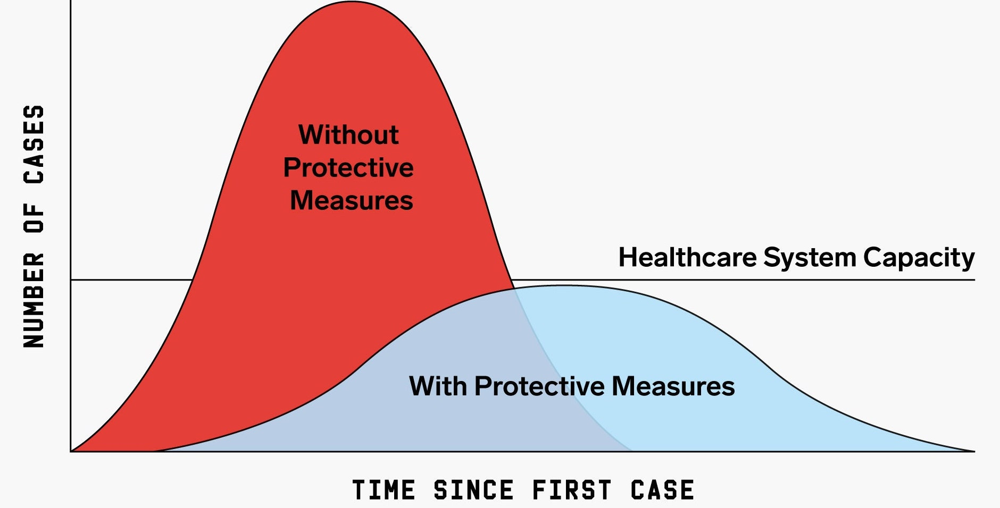

# Project-2-data-pipelines

 

## Scope:

The aim of this project is to compare the COVID-19 infection trajectories of two different countries. This way, it can be ascertained which countries took measures against the pandemic at the earliest stage. The purpose of introducing measures is preventing and delaying the spread of the virus so that large portions of the population aren’t sick at the same time.

## Source:

- Dataset URL: https://www.kaggle.com/barun2104/government-measures-to-combat-covid19
- API URL: https://about-corona.net/documentation

## Description of the dataset:

Column name   | Description
------------- | -------------
ID                 | Unique ID
COUNTRY            | Country Name
ISO                | ISO 3 Country Code
ADMIN_LEVEL_NAME   | Administration Level Name, if available
PCODE              | Pin Code, if available
REGION             | Asia, Americas, Europe, Africa, Middle East, Pacific
LOG_TYPE           | Introduction / extension of measures
CATEGORY           | Health measures, Governance and socio-economic measures, Social distancing, Movement restrictions, Lockdown
MEASURE            | Specific measure
TARGETED_POP_GROUP | Whether the measure is targeted to a particular population group only
COMMENTS           | Extra comments about a particular measure
NON_COMPLIANCE     | Consequences if people don't comply with the measure
SOURCE             | Source type
LINK               | Link to the source
ENTRY_DATE         | Entry date for measure
Alternative source | Alternative source, if any

## Hipotheses:

1) The columns of interest will be:
    - COUNTRY
    - ISO
    - REGION
    - CATEGORY
    - MEASURE
    - COMMENTS
    - SOURCE
    - ENTRY_DATE
 
 2) Some cleaning will be done to the original dataset:
    - Drop duplicates
    - Drop rows with higher number of null values
    - Filling Null Values
    - Correcting values in columns

 3) The API used in this project provides information about the COVID evolution throughout time for a specific country. It requests a string paremeter with the country code in ISO 3166-1 alpha-2 format. For this reason, the ISO column will be modified to meet these requirements.

 4) In the output folder, they can be found the dataset after cleaning and mining; clean.csv and mining.csv, respectively.

 5) The main.py file reads the mining.csv, filters the data with some parameters defined from the user and generates images and a automatic report. It generates also two interactive tables in the browser with detailed comments about the measures applied in each country. 

## To take into consideration

- If you download this code, some libraries are requied to execute it (smtplib, getpass, argparse, nbformat, plotly, orca, among others.)

- Obtain help to run the program from command line: python3 main.py -h

- In main.py change **<from@gmail.com>** with your personal email. 

